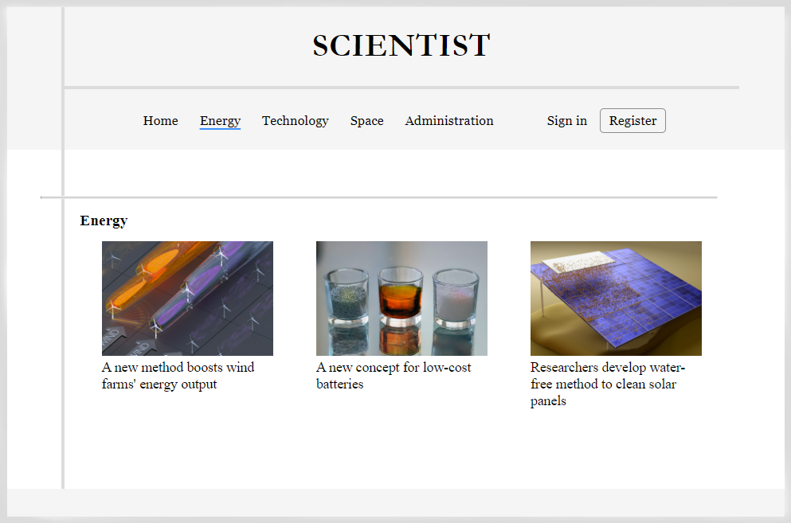

## News web app

This is a simple news web app that I made for a class assignment (Programming of Web Applications). The app is built with PHP/MySQL on the backend and HTML/CSS/JavaScript on the frontend. 

The theme of the assignment, the structure, and the technologies used were predefined. The web app is served locally with Apache/MySQL (XAMPP).

**Requirements**

The main requirements for this assignment were:
- the visitor-oriented part of the app should have three sections: articles dashboard, article details and article categories
- implement regular and administrative sections of the app
- implement CRUD operations on news articles
- implement authentication with session mechanism and hashed passwords
- implement client-side input validation
- use parameterized queries on the backend
- use responsive design

#
**Try it out (with XAMPP)**

- copy the 'www' folder to 'xampp/htdocs'
- start Apache and MySQL server in XAMPP
- execute the 'db/pwa_projekt.sql' script to create the database
- access the web app at http://localhost/www
